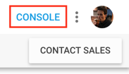
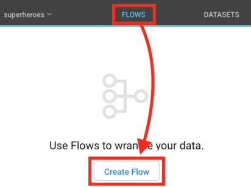
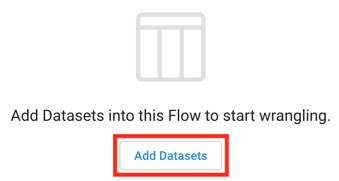
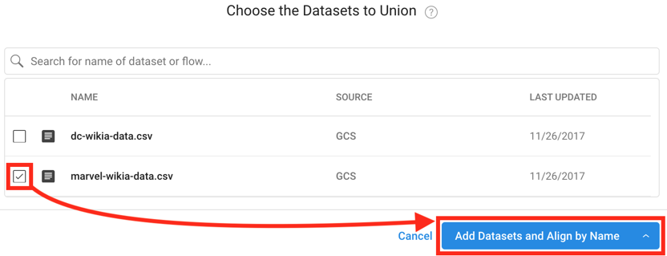
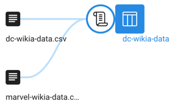

# ETL sobre GCP

TBD

## Contenido

* [Creando el proyecto en GCP](#creando-el-proyecto-en-gcp)
* [Subiendo los datos de prueba](#subiendo-los-datos-de-prueba)
* [Trabajando el ETL](#trabajando-el-etl)
    * [Uniendo los datasets](#uniendo-los-datasets)
    * [Normalizando los datos](#normalizando-los-datos)

## Creando el proyecto en GCP

Lo primero que debemos hacer para trabajar esta POC es crear un nuevo proyecto Google Cloud Platform. Para ello, vamos al [site oficial](https://cloud.google.com/) e iniciamos sesión desde el botón **Sign in** que podemos encontrar en la parte superior derecha. Lo hacemos con nuestra cuenta de [Gmail](https://www.google.com/gmail/).

Una vez hecho, nos dirigimos a la consola de Google Cloud Platform haciendo clic sobre el botón **Console** que se ha dispuesto en la parte superior derecha tras el inicio de sesión.

Ya en la consola, vamos a crear un nuevo proyecto. En la barra superior hay botón titulado **Select a project**; desde este botón se pueden crear nuevos proyectos o seleccionar uno de los ya existentes. Es posible que, por defecto, aparezca ya uno seleccionado; no hay de qué preocuparse, el clic sobre uno u otro te lleva a la misma ventana modal.

En esta ventana, clicamos en el botón correspondiente para crear un nuevo proyecto.

Lo siguiente es indicar un nombre para el proyecto en el campo **Project name**. Yo le he llamado **superheroes**, pero siéntete libre de elegir otro que te resulte más apropiado. Es importante prestar atención al campo **Project ID**: si el nombre propuesto para el proyecto ya está en uso, Google genera un texto aleatorio para usarlo como identificador, y es éste el que debemos usar para trabajar con el proyecto desde, por ejemplo, [Google Cloud SDK](https://cloud.google.com/sdk/docs/).

La creación del proyecto toma aproximadamente un minuto. Verás que en la barra superior, a la derecha, hay una zona de notificaciones; cuando el proyecto esté listo, recibirás el aviso correspondiente en esta zona. Una vez ocurra, seleccionamos el proyecto desde el botón que usamos anteriormente para la creación del proyecto.

La selección del proyecto nos lleva a su dashboard. Podemos aprovechar este momento para __ponernos a mano__ aquellos servicios que vamos a usar en la POC. En el menú lateral **Products & services** localizamos los servicios y hacemos clic sobre el icono de chincheta que lucen a su derecha para hacer **Pin** de ellos en la parte superior de este menú. Los servicios están localizados en las siguientes secciones: [Storage](https://console.cloud.google.com/storage) en **Storage** y [Dataprep](https://console.cloud.google.com/dataprep), [Dataflow](https://console.cloud.google.com/dataflow) y [BigQuery](https://console.cloud.google.com/bigquery) en **Big Data**.

Con esto tendríamos lista la creación del proyecto. Vamos a por **Dataprep**.

## Subiendo los datos de prueba

Para esta POC vamos a usar dos datasets que contienen datos de superheroes de DC y de Marvel. Se han descargado de [este repositorio](https://github.com/fivethirtyeight/data/tree/master/comic-characters), cuyos responsables se han preocupado de obtenerlos previamente de [DC Wikia](http://dc.wikia.com/wiki/Main_Page) y [Marvel Wikia](http://marvel.wikia.com/wiki/Main_Page).

Puedes descargar los datasets desde los siguientes enlaces:

* Dataset de DC Wikia, documento [dc-wikia-data.csv](./assets/data/dc-wikia-data.csv).
* Dataset de Marvel Wikia, documento [marvel-wikia-data.csv](./assets/data/marvel-wikia-data.csv).

Seguidamente debemos subirlos a **Storage**, ya que **Dataprep** se apoya en este servicio para hacer la analítica y los procesos de transformación que procedan. Podríamos hacerlo nosotros creando un nuevo bucket en **Storage** y subiéndolos ahí, pero **Dataprep** ya lo hace automáticamente (crear un nuevo bucket) cuando se inicia por primera vez, así que le delegaremos esta tarea.

**Dataprep** es una herramienta que Google ofrece en colaboración con [Trifacta](https://www.trifacta.com/), y por tanto es nececesario permitir a éstos el acceso a los datos del proyecto. En **Dataprep** se nos muestra un diálogo que informa de esto y que debemos aceptar pulsando el botón **Allow**; una vez hecho, ya no se mostrará más este mensaje.

Un par de minutos más tarde, una vez se haya completado la autorización de acceso a Trifacta, se nos redirige a **Dataprep**. En este primer acceso debemos seleccionar el bucket de **Storage** sobre el cuál **Dataprep** trabajará por defecto. De hecho, tal y como se ha comentado más arriba, **Dataprep** ya ha creado un bucket por nosotros, así que nos limitamos a usarlo.

Lo siguiente que haremos será crear los datasets a partir de los documentos CSV de Wikia que descargamos hace unos minutos. Para ello, nos dirigimos a la sección **Datasets** desde el botón situado en la barra superior.

Hacemos clic en el botón **Import Data**.

En la página de importación se nos ofrecen tres opciones: podemos importar datos desde uno o varios documentos subidos desde nuestro equipo, seleccionados desde **Storage** o bien procedentes de una tabla de **BigQuery**. Nos decidimos por la primera opción, que es la que cubre nuestro caso, y clicamos el botón **Choose a file**. Seleccionamos los documentos CSV y aceptamos; **Dataprep** los subirá a la carpeta **upload** del bucket de **Storage**.

Una vez subidos los documentos, **Dataprep** dispone una previsualización de los datos que contienen en la zona derecha. Verificamos que todo esté correcto y hacemos clic en el botón **Import Datasets**.

Se nos devuelve a la sección de **Datasets** donde ya aparecen listados los datasets recién importados. Con esto damos por finalizada la subida de los CSV a **Storage** y estamos listos para empezar desarrollar el proceso de ETL.

## Trabajando el ETL

Para definir un pipeline de transformaciones en **Dataprep** necesitamos acceder a la sección **Flows** y crear un nuevo flujo de trabjo desde el botón **Create Flow**.

Le damos un nombre al flujo y continuamos.

Lo primero que haremos será añadir los datasets que [subiendo en el paso anterior](#subiendo-los-datos-de-prueba) al flujo que acabamos de crear. Para ello hacemos clic sobre el botón **Add Datasets** que aparece en el centro de la pantalla.

En la ventana modal que aparece, filtramos la colección de datasets por **Imported** y seleccionamos los que andamos buscando; para esta POC recordemos que estos datasets son los correspondientes a los documentos **dc-wikia-data.csv** y **marvel-wikia-data.csv**. Por último, confirmamos la selección con el botón **Add**.

La selección de los datasets nos lleva de vuelta a la pantalla principal del flujo. Es en este punto cuando entra en juego el concepto de **recetas**: con ellas _cocinamos_ los datos, es decir, aplicamos las transformaciones que procedan en cada momento. Y como en las recetas culinarias, estas también tienen pasos.

### Uniendo los datasets

Vamos, pues, a hacer una nueva receta con nuestros datasets. ¿En qué va a consistir? Pues muy sencillo: vamos a unir los datos de ambos datasets para trabajar lo antes posible sobre un solo conjunto de datos, que es una buena práctica.

Seleccionamos uno de los dos datasets, por ejemplo **dc-wikia-data.csv**. En la zona derecha vemos que aparece un panel titulado **Details** que muestra -oh, sorpresa- los datalles de aquello que está seleccionado. Vemos también el botón **Add new Recipe**: lo pulsamos.

Si nos fijamos en el dataset **dc-wikia-data.csv** apreciaremos que la receta se ha añadido correctamente generando, además, un nuevo dataset. Es importante comprender esto, ya que será una constante en el uso de **Dataprep**: cada receta de transformaciones aplicada sobre un dataset genera uno nuevo como resultado de su aplicación.

La receta no tiene aún pasos definidos, así que vamos a ponerle remedio. La seleccionamos y hacemos clic en el botón **Edit Recipe** de su panel de **Details**.

La vista de receta es muy llamativa. Por un lado, muestra una pre visualización de los datos actuales del dataset; conforme se vayan añadiendo pasos a la receta, esta pre visualización se irá actualizando. La cabecera de cada columna muestra el tipo de dato que **Dataprep** ha inferido de los valores contenidos en dicha columna; desde la propia cabecera puede cambiarse en caso de no ser el correcto. También se muestra de manera gráfica la distribución de los datos de cada columna; podemos solicitar a **Dataprep** que nos sugiera posibles acciones -transformaciones- basadas en estas distribuciones.

Pulsamos sobre el botón **Receipe**, situado en la barra de herramientas superior de la derecha, para mostrar el panel de pasos. Seguidamente, añadimos un paso con el botón **Add New Step**.

En la caja de transformaciones, buscamos por **union** y seleccionamos aquella que aparece. Esta transformación añade las filas de dos o varios datasets en uno nuevo, que es justo lo que vamos buscando.

La pantalla de edición de la transformación **Union** aparece con el estado actual; debemos añadir el otro dataset que habíamos seleccionado en el flujo, pues por defecto solo aparece aquel sobre el cuál estamos aplicando la transformación. Lo haremos desde el botón **Add datasets**.

En la ventana modal que aparece seleccionamos el dataset **marvel-wikia-data.csv** y aceptamos con el botón **Add Datasets and Align by Name**.

Ahora sí, la edición de la transformación **Union** parece correcta. Puesto que ambos datasets contienen las mismas columnas, esta unión es directa y no requiere ninguna otra manipulación.

De nuevo en la vista de la receta, podemos confirmar cómo la transformación **Union** se muestra como el primer -y único- paso de la misma.

Damos por buena la receta y volvemos a la vista del flujo. Para ello hacemos clic sobre el su nombre, el del flujo, en la parte superior izquierda de la pantalla.

En esta vista del flujo vemos cómo se ha representado gráficamente la transformación **Union** entre los datasets: supone una gran ayuda visual, ya que de un vistazo podemos interpretar sin lugar a dudas lo que ocurre en esa receta.

Este primer paso del ETL termina. Vamos con el siguiente.

### Normalizando los datos

TBD